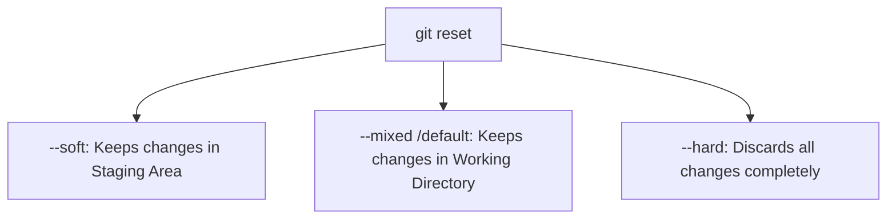

# How to Use Git Reset

`git reset` is a powerful tool to undo changes, unstage files, or revert your repository back to a previous commit.

---

## The 3 Main Modes of `git reset`

Depending on what you want to do with your code changes, you can use one of these three modes:



### 1. Soft Reset (`--soft`)
**Use case:** You want to undo the last commit but keep your changes staged so you can edit the commit message or add more files.
```bash
git reset --soft HEAD~1
```
* **What happens:** The last commit is undone. All your modified files are still in the **Staging Area** (green/ready to commit).

### 2. Mixed Reset (`--mixed` or default)
**Use case:** You want to undo the last commit and unstage the files, but keep the code changes on your disk to rewrite or modify them.
```bash
git reset HEAD~1
# OR
git reset --mixed HEAD~1
```
* **What happens:** The last commit is undone, and all modified files are moved back to your **Working Directory** (red/unstaged).

### 3. Hard Reset (`--hard`)
**Use case:** You want to completely discard your last commit and all local changes to start over from a clean state.
```bash
git reset --hard HEAD~1
```
* **⚠️ WARNING:** This will permanently delete all uncommitted changes and the undone commit. There is no undo for this command.

---

## Common Examples

### A. Unstage a file you accidentally added (`git add`)
If you ran `git add secret.txt` and want to unstage it:
```bash
git reset secret.txt
```

### B. Discard all uncommitted changes on disk
If you made edits to files and want to discard all of them and return to your last commit:
```bash
git reset --hard HEAD
```

### C. Reset to a specific commit hash
If you want to jump back to a specific commit in your log:
1. Find the commit hash:
   ```bash
   git log --oneline
   ```
   *(e.g., `09d67c1 Add register ft.`)*
2. Reset to that commit:
   ```bash
   git reset --hard 09d67c1
   ```

---

## Summary of Reference Names
* `HEAD`: The current commit you are on.
* `HEAD~1`: One commit before the current one.
* `HEAD~2`: Two commits before the current one.
* `<commit_hash>`: The unique SHA-1 identifier of a commit (e.g., `09d67c1ed7`).
